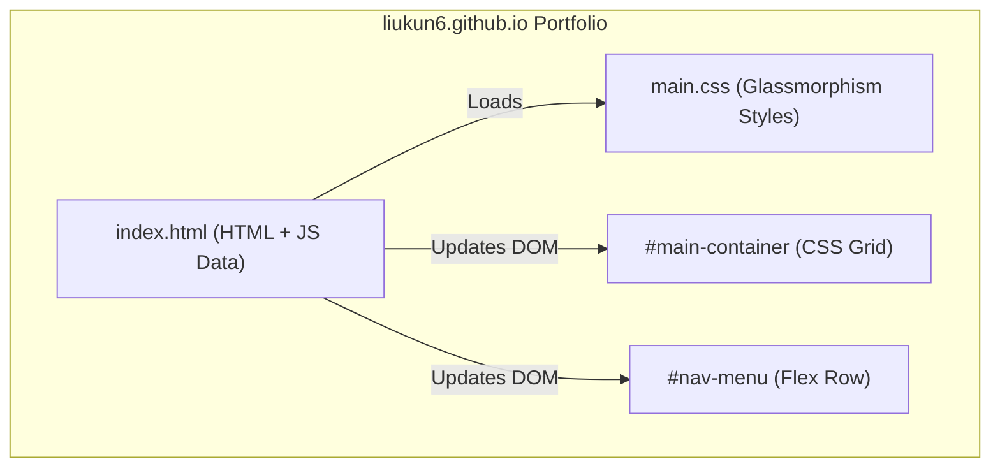

# Light-Mode Glassmorphism Redesign Implementation Plan

> **For agentic workers:** REQUIRED SUB-SKILL: Use superpowers:subagent-driven-development to implement this plan task-by-task. Steps use checkbox (`- [ ]`) syntax for tracking.

**Goal:** Rebuild the personal portfolio page to match the premium Light-Mode Glassmorphism design mockup.

**Architecture:** Update static `index.html` structure, embed detailed description/badge metadata into the JavaScript dataset, and compile styled, responsive components via vanilla CSS in `main.css`.

**Architecture Diagram:**



**Tech Stack:** Vanilla HTML5, CSS Grid/Flexbox, ES6+ JavaScript.

---

### Task 1: Enhance the Dataset in `index.html`

**Files:**
- Modify: [index.html](file:///Users/liukun/Documents/code/liukun6.github.io/index.html#L47-L202)

- [ ] **Step 1: Update Javascript dataset arrays**
Add `desc` and `badge` fields to every example item in `CG_EXAMPLE`, `DGGS_EXAMPLE`, and `WEBGL_EXAMPLES`.
Modify lines 47-202 to:
```javascript
    const CG_EXAMPLE = {
      type: 'cg-example',
      groups: [
        {
          name: 'convexHull',
          methods: [
            {
              file: 'grahamScanCH',
              title: "Convex Hulls in Two Dimensions: Graham's Algorithm",
              desc: "Graham's scan algorithm to construct 2D convex hulls.",
              badge: "</>"
            },
            {
              file: 'upperLowerCH',
              title: 'Convex Hulls in Two Dimensions: Lower Bound',
              desc: "Construct upper and lower bounds for 2D convex hulls.",
              badge: "</>"
            },
            {
              file: 'incrementalCH',
              title: 'Convex Hulls in Two Dimensions: Incremental Algorithm',
              desc: "Randomized incremental algorithm for 2D convex hulls.",
              badge: "</>"
            },
            {
              file: 'incremental3DCH',
              title: 'Convex Hulls in Three Dimensions: Incremental Algorithm',
              desc: "Randomized incremental algorithm for 3D convex hulls.",
              badge: "</>"
            }
          ]
        },
        {
          name: 'intersection',
          methods: [
            {
              file: 'convexIntersect',
              title: 'Intersection of Convex Polygons',
              desc: "Compute the intersection area of two convex polygons.",
              badge: "</>"
            },
            {
              file: 'segmentsIntersect',
              title: 'Intersection of Segments',
              desc: "Sweep-line algorithm to find all segment intersections.",
              badge: "</>"
            }
          ]
        },
        {
          name: 'triangulation',
          methods: [
            {
              file: 'earTriangulate',
              title: 'Triangulation by Ear Removal',
              desc: "Triangulate any simple polygon using ear removal.",
              badge: "</>"
            },
            {
              file: 'trapezoidTriangulate',
              title: 'Trapezoidalization & Monotone Polygon Triangulation',
              desc: "Trapezoidal decomposition and monotone triangulation.",
              badge: "</>"
            }
          ]
        },
        {
          name: 'voronoi',
          methods: [
            {
              file: 'halfplanesVD',
              title: 'Voronoi Diagram: Intersection of Halfplanes',
              desc: "Construct Voronoi diagram by halfplane intersections.",
              badge: "</>"
            },
            {
              file: 'incrementalVD',
              title: 'Voronoi Diagram: Incremental Algorithm',
              desc: "Incremental construction of 2D Voronoi diagrams.",
              badge: "</>"
            },
            {
              file: 'sweepVD',
              title: "Voronoi Diagram: Sweep/Fortune's Algorithm",
              desc: "Fortune's sweep-line algorithm for Voronoi diagrams.",
              badge: "</>"
            }
          ]
        },
        {
          name: 'delaunay',
          methods: [
            {
              file: 'incrementalDT',
              title: 'Delaunay Trianglation: Randomized Incremental Algorithm',
              desc: "Randomized incremental Delaunay triangulation.",
              badge: "</>"
            }
          ]
        },
        {
          name: 'spaceTree',
          methods: [
            {
              file: 'KDTree',
              title: 'K Dimensional Tree',
              desc: "K-dimensional tree search structure for spatial points.",
              badge: "</>"
            }
          ]
        }
      ]
    };

    const DGGS_EXAMPLE = {
      type: 'dggs-example',
      file: 'dggs',
      title: 'Discrete Global Grid System',
      desc: "Hierarchical global grid systems for multi-scale mapping.",
      badge: "</>"
    };

    const WEBGL_EXAMPLES = [
      {
        file: 'depthBuffer',
        title: 'Depth Buffer',
        desc: "Visualize depth buffer value calculations and linear depth.",
        badge: "<//>"
      },
      {
        file: 'shading',
        title: 'Blinn-Phong Shading',
        desc: "Sleek Blinn-Phong shading and specular reflection models.",
        badge: "<//>"
      },
      {
        file: 'shadingModel',
        title: 'Blinn-Phong Shading Model',
        desc: "Advanced Blinn-Phong shading applied to interactive meshes.",
        badge: "<//>"
      },
      {
        file: 'shadingMaterialModel',
        title: 'Material Shading',
        desc: "Simulate diffuse, ambient, and specular material properties.",
        badge: "<//>"
      },
      {
        file: 'texture',
        title: 'Texture Shading',
        desc: "Apply diffuse textures and texture coordinates mapping.",
        badge: "<//>"
      },
      {
        file: 'bumpMapping',
        title: 'Bump/Normal Mapping',
        desc: "Add fine surface detail using normal maps and TBN vectors.",
        badge: "<//>"
      },
      {
        file: 'parallaxMapping',
        title: 'Parallax Mapping',
        desc: "Simulate deep surface relief using displacement offset maps.",
        badge: "<//>"
      },
      {
        file: 'shadow',
        title: 'Shadow Mapping',
        desc: "Render soft real-time shadows using shadow map projections.",
        badge: "<//>"
      },
      {
        file: 'rayTracing',
        title: 'Whitted-Style Ray Tracing',
        desc: "Recursive Whitted-style ray tracing with reflection/refraction.",
        badge: "<//>"
      },
      {
        file: 'pathTracing',
        title: 'Path Tracing',
        desc: "Monte Carlo path tracing with global illumination.",
        badge: "<//>"
      },
      {
        file: 'pathTracingDenoise',
        title: 'Path Tracing with Hybrid Denoiser',
        desc: "Interactive path tracing with hybrid temporal-spatial denoiser.",
        badge: "<//>"
      },
      {
        file: 'glTF-PBR',
        title: 'Physically Based Rendering (glTF metallic-roughness material model)',
        desc: "Physically based rendering using the standard glTF material.",
        badge: "<//>"
      },
      {
        file: 'toneMapping',
        title: 'HDR (High Dynamic Range) Image Tone Mapping',
        desc: "High Dynamic Range rendering with ACES tone mapping.",
        badge: "<//>"
      },
      {
        file: 'cubemap',
        title: 'Create a Skybox Using Cubemap',
        desc: "Render an immersive 3D environment skybox using cubemaps.",
        badge: "<//>"
      },
      {
        file: 'glTF-PBR-IBL',
        title: 'Physically Based Rendering with Image-Based Lighting',
        desc: "Physically based rendering with image-based light maps.",
        badge: "<//>"
      },
    ];
```

- [ ] **Step 2: Commit changes**
Run:
```bash
git add index.html
git commit -m "feat: enhance portfolio dataset with descriptions and badges"
```

---

### Task 2: Rebuild Card Template and Fix Display Grid Bug in `index.html`

**Files:**
- Modify: [index.html](file:///Users/liukun/Documents/code/liukun6.github.io/index.html#L204-L210)

- [ ] **Step 1: Replace exampleTemplate string**
Modify the template at lines 204-210 to include the new DOM structure (wrapper, badge, and content fields):
```diff
-    const exampleTemplate = `
-      <div class="item">
-        
-        <span class="content">
-          <a href="#{url}">#{title}</a><br>
-        </span>
-      </div>`
+    const exampleTemplate = `
+      <div class="item" onclick="location.href='#{url}'">
+        <div class="img-container">
+          
+          <div class="tech-badge">#{badge}</div>
+        </div>
+        <div class="content">
+          <h3 class="card-title">#{title}</h3>
+          <p class="card-desc">#{desc}</p>
+          <span class="card-link">#{linkText}</span>
+        </div>
+      </div>`
```

- [ ] **Step 2: Update renderContainer function implementation**
Modify lines 276-322 of `index.html` to inject the new tokens and resolve the display grid bug:
```diff
     function renderContainer(page = 'cg-example') {
       containerEle.className = page;
       const items = [];
       if (page === 'cg-example') {
         let path;
         CG_EXAMPLE.groups.forEach((group) => {
           group.methods.forEach((item) => {
             path = `cg-example/${group.name}/${item.file}`
             items.push({
               ...item,
               url: path + '.html',
               imgSrc: path + '.png',
+              linkText: 'Learn - Geometry'
             })
           });
         });
       } else if (page === 'dggs-example') {
         const { file, title } = DGGS_EXAMPLE;
         items.push({
-          title,
+          ...DGGS_EXAMPLE,
           url: `dggs-example/${file}.html`,
           imgSrc: `dggs-example/${file}.png`,
+          linkText: 'Learn - DGGS'
         });
       } else if (page === 'webgl-example') {
-        WEBGL_EXAMPLES.forEach(({ title, file }) => {
+        WEBGL_EXAMPLES.forEach((item) => {
           items.push({
-            title,
-            url: `webgl-example/${file}.html`,
-            imgSrc: `webgl-example/${file}.png`,
+            ...item,
+            url: `webgl-example/${item.file}.html`,
+            imgSrc: `webgl-example/${item.file}.png`,
+            linkText: 'Learn - WebGL'
           });
         });
       }
 
       const content = items.map(item =>
         exampleTemplate.replace('#{url}', item.url)
           .replace('#{src}', item.imgSrc)
           .replace('#{title}', item.title)
+          .replace('#{badge}', item.badge)
+          .replace('#{desc}', item.desc)
+          .replace('#{linkText}', item.linkText)
       ).join('');
       containerEle.innerHTML = content;
 
       aboutEle.style.display = 'none';
-      containerEle.style.display = 'block';
+      containerEle.style.display = 'grid';
     }
```

- [ ] **Step 3: Commit changes**
Run:
```bash
git add index.html
git commit -m "feat: rebuild card HTML structure and fix display override bug"
```

---

### Task 3: Redesign the Floating Navigation Bar with Brand Header

**Files:**
- Modify: [index.html](file:///Users/liukun/Documents/code/liukun6.github.io/index.html#L17-L26)
- Modify: [main.css](file:///Users/liukun/Documents/code/liukun6.github.io/main.css#L56-L117)

- [ ] **Step 1: Re-structure navigation HTML**
Modify `index.html` lines 17-26 to wrap navigation in a container that supports the site title branding:
```diff
   <header>
     <nav>
+      <div class="nav-brand">Kun Liu's Blog</div>
       <ul id="nav-menu">
         <li id="cg-example">Computational Geometry</li>
         <li id="webgl-example">WebGL</li>
         <li id="dggs-example">DGGS</li>
         <li id="about">About</li>
       </ul>
     </nav>
   </header>
```

- [ ] **Step 2: Style the new layout in main.css**
Modify `main.css` lines 56-117. Use Flexbox to align the branding to the left and links to the right, and introduce the pill background active state:
```diff
 nav {
   max-width: 960px;
   margin: 30px auto;
-  padding: 10px 24px;
+  padding: 12px 24px;
   background: var(--glass-bg);
   backdrop-filter: blur(12px);
   -webkit-backdrop-filter: blur(12px);
   border: 1px solid var(--glass-border);
   border-radius: 50px;
   box-shadow: 0 8px 32px 0 var(--glass-shadow);
+  display: flex;
+  justify-content: space-between;
+  align-items: center;
+}
+
+.nav-brand {
+  font-weight: 700;
+  font-size: 1.25rem;
+  color: var(--text-primary);
+  letter-spacing: -0.02em;
 }
 
 #nav-menu {
   padding: 0;
   margin: 0;
   list-style-type: none;
   display: flex;
-  justify-content: space-around;
   align-items: center;
+  gap: 8px;
 }
 
 #nav-menu li {
   position: relative;
   display: inline-block;
-  padding: 0.5rem 1rem;
+  padding: 8px 16px;
   color: var(--text-secondary);
   font-weight: 500;
   cursor: pointer;
   text-decoration: none;
-  transition: color 0.3s ease;
-}
-
-#nav-menu li::before {
-  content: "";
-  position: absolute;
-  left: 10%;
-  bottom: 0;
-  height: 3px;
-  background: var(--accent-hover);
-  border-radius: 2px;
-  width: 80%;
-  transition: transform 0.3s ease;
-  transform: scaleX(0);
+  border-radius: 8px;
+  transition: color 0.25s ease, background-color 0.25s ease, box-shadow 0.25s ease;
 }
 
 #nav-menu li:hover {
   color: var(--text-primary);
+  background-color: rgba(255, 255, 255, 0.35);
 }
 
-#nav-menu li:hover::before {
-  transform: scaleX(1);
-}
-
 #nav-menu li.active {
-  color: var(--accent-hover);
+  color: var(--text-primary);
+  background-color: rgba(255, 255, 255, 0.75);
   font-weight: 600;
-}
-
-#nav-menu li.active::before {
-  transform: scaleX(1);
+  box-shadow: 0 4px 12px var(--glass-shadow);
 }
```

- [ ] **Step 3: Commit changes**
Run:
```bash
git add index.html main.css
git commit -m "style: rebuild navigation with branding title and pill active background"
```

---

### Task 4: Rebuild CSS Grid and Card Styles in `main.css`

**Files:**
- Modify: [main.css](file:///Users/liukun/Documents/code/liukun6.github.io/main.css#L124-L189)

- [ ] **Step 1: Update main container, card wrappers and elements in main.css**
Modify lines 124-189 of `main.css` to build out the grid columns, card formatting, white image border wrapper, absolute tech badge, descriptions and link hover states:
```diff
 #main-container {
   display: grid;
   grid-template-columns: repeat(auto-fit, minmax(280px, 1fr));
   gap: 24px;
 }
 
 #main-container .item {
   background: var(--glass-bg);
   backdrop-filter: blur(12px);
   -webkit-backdrop-filter: blur(12px);
   border: 1px solid var(--glass-border);
   border-radius: 16px;
-  padding: 16px;
+  padding: 12px;
   box-shadow: 0 8px 24px 0 var(--glass-shadow);
-  transition: transform 0.3s cubic-bezier(0.25, 0.8, 0.25, 1), box-shadow 0.3s ease, border-color 0.3s ease;
+  transition: transform 0.3s cubic-bezier(0.25, 0.8, 0.25, 1), box-shadow 0.3s ease, border-color 0.3s ease, background-color 0.3s ease;
   display: flex;
   flex-direction: column;
-  gap: 12px;
+  gap: 16px;
+  cursor: pointer;
 }
 
 #main-container .item:hover {
-  transform: translateY(-5px);
-  box-shadow: 0 12px 30px rgba(0, 0, 0, 0.08);
+  transform: translateY(-6px);
+  box-shadow: 0 16px 36px rgba(0, 0, 0, 0.08);
   border-color: rgba(255, 255, 255, 0.95);
+  background: rgba(255, 255, 255, 0.6);
+}
+
+.img-container {
+  background: #ffffff;
+  padding: 6px;
+  border-radius: 12px;
+  border: 1px solid rgba(255, 255, 255, 0.8);
+  position: relative;
+  overflow: hidden;
+  display: flex;
 }
 
 #main-container img {
   width: 100%;
   object-fit: cover;
-  border-radius: 10px;
-  border: 1px solid rgba(0, 0, 0, 0.05);
+  border-radius: 8px;
   opacity: 0;
   transition: opacity 0.3s ease-in-out;
 }
 
 #main-container.cg-example img,
 #main-container.webgl-example img {
   aspect-ratio: 8 / 5;
 }
 
 #main-container.dggs-example img {
   aspect-ratio: 1 / 1;
 }
 
 #main-container img.loaded {
   opacity: 1;
 }
 
+.tech-badge {
+  position: absolute;
+  bottom: 12px;
+  right: 12px;
+  background: rgba(255, 255, 255, 0.85);
+  backdrop-filter: blur(4px);
+  -webkit-backdrop-filter: blur(4px);
+  border: 1px solid rgba(0, 0, 0, 0.05);
+  padding: 4px 10px;
+  border-radius: 20px;
+  font-size: 0.75rem;
+  font-family: monospace;
+  font-weight: 600;
+  color: var(--text-secondary);
+  box-shadow: 0 2px 8px rgba(0, 0, 0, 0.03);
+}
+
 #main-container .content {
   display: flex;
   flex-direction: column;
-  gap: 6px;
+  gap: 8px;
+  padding: 0 4px 4px 4px;
+}
+
+.card-title {
+  margin: 0;
+  font-size: 1.15rem;
+  font-weight: 700;
+  color: var(--text-primary);
+  line-height: 1.3;
+}
+
+.card-desc {
+  margin: 0;
+  font-size: 0.9rem;
+  color: var(--text-secondary);
+  line-height: 1.5;
+  display: -webkit-box;
+  -webkit-line-clamp: 2;
+  -webkit-box-orient: vertical;
+  overflow: hidden;
+}
+
+.card-link {
+  font-size: 0.9rem;
+  font-weight: 600;
+  color: var(--accent-color);
+  text-decoration: underline;
+  transition: color 0.2s ease;
+  margin-top: 4px;
 }
 
-#main-container .content a {
-  color: var(--text-primary);
-  font-weight: 600;
-  font-size: 1.1rem;
-  text-decoration: none;
-  transition: color 0.2s ease;
-}
-
-#main-container .content a:hover {
-  color: var(--accent-hover);
+#main-container .item:hover .card-link {
+  color: var(--accent-hover);
 }
```

- [ ] **Step 2: Commit changes**
Run:
```bash
git add main.css
git commit -m "style: rebuild responsive grid layout and card designs to match mockup"
```

---

## Verification Plan

### Automated Tests
*   Open the terminal and check that `npx http-server` is serving without issues.
*   Validate console warnings/errors by navigating in Playwright.

### Manual Verification
1.  Navigate to `http://localhost:8085/`.
2.  Verify the navigation bar matches the mockup:
    *   `Kun Liu's Blog` title displays on the left, navigation items on the right.
    *   The active tab is styled as a semi-transparent white rounded button/pill.
3.  Verify the card gallery layout:
    *   Items are aligned in a 3-column CSS Grid.
    *   Each card features a white padding wrapper around the image, a tech badge overlay in the bottom right corner (e.g. `</>` or `<//>`), a bold title, a short description paragraph, and an underlined link.
    *   Hovering over any card lifts it with a smooth transition, expands the shadow, and shifts the link color to teal.
    *   Clicking anywhere on the card redirects the browser to the respective page.
